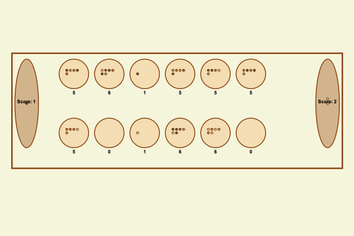

# Gebeta - Traditional Ethiopian Mancala Game

[](https://github.com/yabtesfu/Gebeta-Game/actions/workflows/ci.yml)

A Java GUI implementation of the traditional Ethiopian board game Gebeta (Mancala), featuring an AI opponent (minimax with alpha-beta pruning), a fully unit-tested rules engine, and a Gradle build with continuous integration.



> The demo above is rendered directly from the game's own drawing code (see
> [tools/DemoGifGenerator.java](tools/DemoGifGenerator.java)), so it's an exact
> capture of the in-game sowing animation.

## Download & Play

Build a self-contained, runnable jar and launch it — no IDE required, just a JDK:

```bash
./gradlew jar
java -jar build/libs/gebeta.jar
```

Or run it straight from source with `./gradlew run`.

## About the Developer

**Made by:** Yabetse Tesfaye  
**Institution:** Addis Ababa Institute of Technology  
**Program:** Software Engineer 
**Year:** 5th Year Student  
**ID:** UGR/31352/15

## Game Features

- **Traditional Gebeta Rules:** Complete implementation of the classic Gebeta game mechanics
- **Two game modes:**
  - **Two Players** — local hotseat play
  - **Play vs Computer** — an AI opponent with **Easy / Medium / Hard** difficulty
- **AI opponent:** A computer player built on the **minimax algorithm with alpha-beta pruning**.
  It looks several moves ahead, correctly handles Gebeta's "extra turn" rule, and gets
  stronger as difficulty increases (search depth 1 → 5 → 9). The AI runs on a background
  thread so the interface stays responsive.
- **Beautiful GUI:** Aesthetic board design with colorful stones and intuitive interface
- **Multiple Panels:**
  - Intro page with background image
  - Game board with full functionality
  - About page with developer information
  - Help page with game instructions and tutorial video link
- **Enhanced User Experience:** Hover effects, "Computer is thinking…" status, responsive design
- **Game Management:** New game, reset, and navigation features
- **Unit-tested rules engine:** A JUnit 5 test suite verifies the game rules, run on every push by CI

## How to Build and Run

The project uses **Gradle** via the included wrapper, so you don't need Gradle
installed — only a JDK (17 or newer).

### Run the game

```bash
./gradlew run
```

### Run the tests

```bash
./gradlew test
```

### Build everything (compile + test + package)

```bash
./gradlew build
```

Continuous integration (GitHub Actions, see [.github/workflows/ci.yml](.github/workflows/ci.yml))
compiles the project and runs the full test suite on every push and pull request.

## Game Rules

1. **Setup:** Each small pit starts with 4 stones
2. **Turns:** Players take turns picking up all stones from one of their pits
3. **Distribution:** Stones are distributed one by one into subsequent pits counter-clockwise
4. **Extra Turns:** If the last stone lands in your store, you get another turn
5. **Capture:** If the last stone lands in an empty pit on your side, you capture that stone and all stones in the opposite pit
6. **Game End:** The game ends when one player has no stones left in their small pits
7. **Winner:** The player with the most stones in their store wins

## Controls

- **Mouse Click:** Click on your pits to make moves
- **New Game:** Start a fresh game
- **Help:** Access game instructions and tutorial video
- **Back to Menu:** Return to the main menu

## Testing

The rules engine has a JUnit 5 suite covering sowing, captures, extra turns,
illegal-move rejection, and end-of-game collection:

```bash
./gradlew test
```

## Project Structure

```
src/
  main/
    java/            # application source
    resources/       # background.png (loaded from the classpath)
  test/
    java/            # JUnit 5 tests
build.gradle         # Gradle build configuration
.github/workflows/   # GitHub Actions CI
```

**Rules & AI (pure logic, no UI dependency):**
- `MancalaState.java` - The complete game rules as a plain `int[14]` board. No Swing
  imports, which is what makes it testable and lets the AI simulate positions freely.
- `MancalaAI.java` - Computer opponent using minimax with alpha-beta pruning.
- `MancalaStateTest.java` - JUnit 5 unit tests for the rules engine.

**User interface (Swing):**
- `Gebeta.java` - Main application class and screen navigation
- `IntroPanel.java` - Introduction screen and mode/difficulty selection
- `GamePanel.java` - Game interface, input handling, and AI turn orchestration
- `AboutPanel.java` - Developer information
- `HelpPanel.java` - Game instructions and help
- `GameBoard.java` - Bridges the rules engine to the on-screen board and stones
- `Pit.java` - Visual pit (geometry + drawing)
- `Stone.java` - Stone object for visual representation

## Architecture

The game logic is fully decoupled from the user interface. All rules live in the pure
`MancalaState` class, which has no dependency on Swing. This separation is what enables
two things that would otherwise be impossible:

1. **Testability** — the rules can be unit-tested directly (see `MancalaStateTest`).
2. **AI search** — `MancalaAI` copies the state and simulates thousands of hypothetical
   moves via minimax without ever touching the rendered board.

`GameBoard` keeps the visual `Pit`/`Stone` objects in sync with the `MancalaState` after
every move, so the display always mirrors the single source of truth for the rules.

## Object-Oriented Design

The project demonstrates proper OOP principles:

- **Encapsulation:** Each class manages its own data and behavior
- **Inheritance:** Proper use of Java Swing component hierarchy
- **Polymorphism:** Different panel types implementing common interfaces
- **Abstraction:** Clean separation of game logic from UI components

## Tutorial Video

For additional help, watch the tutorial video: [Gebeta Tutorial](https://www.youtube.com/watch?v=o5HaaipZ3EA)

Enjoy playing Gebeta!
